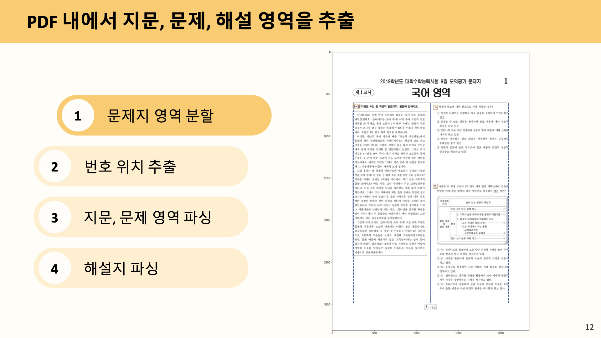

# 국어시험지 문제/지문별 이미지 분할 알고리즘

## 기능

- 국어모의고사 pdf를 입력받아서 문제와 지문들을 이미지로 잘라내고 번호대로 저장해줍니다.
- ebs 형식의 해설지도 해설별 이미지로 잘라서 저장합니다.
- 국어가 아닌 모든 모의고사 형식 과목도 적용됩니다.

## 사용법

```python
import ksatparser

pdf_path = "your_pdf_path"
output_dir = "your_output_dir"

ksatparser.parse_problem(pdf_path, output_dir) # 기출문제 파싱
ksatparser.parse_solution(pdf_path, output_dir) # 해설지 파싱
```

## 알고리즘 설명




## 안내사항

- 이 성과는 2022년도 과학기술정보통신부의 재원으로 정보통신기획평가원의 지원을 받아 수행된 연구입니다. (IITP-2022-SW마에스트로과정)
- [서당개 애플리케이션](https://github.com/Mango-Juice/im-application-public) (태블릿 수능 국어 앱) 의 컨텐츠를 재가공하기 위해 쓰인 알고리즘입니다.
